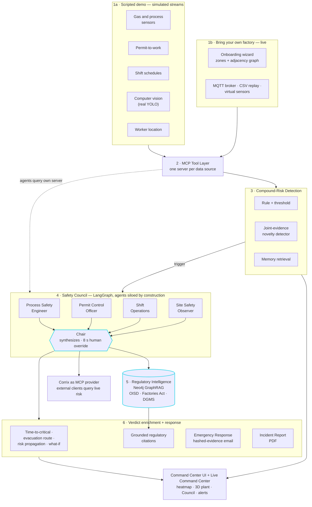

<div align="center">

<h1>CORRIX</h1>

### The correlation layer industrial safety never had

**AI-powered industrial safety intelligence that detects _compound risk_: dangerous combinations of ordinary-looking conditions that no single sensor, system, or team would flag alone.**

<br>

[](#testing)
[](#technology)
[](#technology)
[](#license)
[](#)

<br>

**Backend**&nbsp;


**Frontend**&nbsp;


<br>

[Overview](#overview) · [Capabilities](#capabilities) · [Architecture](#architecture) · [Quick start](#quick-start) · [What is real vs. simulated](#what-is-real-vs-simulated) · [Documentation](#documentation)

</div>

---

## Overview

Indian heavy industry runs five or more safety systems that are each individually competent and collectively blind to each other. A rising gas reading is routine. A hot-work permit is routine. A hot-work permit in a zone where gas is trending up, right before a shift changeover, with a worker present, is a **compound risk** that no single system is built to catch, because no single system holds all four facts at once.

Corrix is the correlation layer that closes that gap. It fuses five normally-siloed data streams, gas and process sensors, permit-to-work records, shift schedules, computer-vision site observation, and worker location, into one reasoning layer that catches these combinations before they become incidents, with full explainable reasoning and minutes of lead time. It is grounded in the real, verifiable June 8, 2025 Visakhapatnam Steel Plant incident.

> **See it live.** The app opens on a landing page; select **Launch live demo** to enter the command center. A short context note and a guided tour introduce the interface, and a floating **Ask about Corrix** assistant answers questions about the system at any time.

---

## Capabilities

| Capability | What it does |
|---|---|
| **The Safety Council** | Five specialized AI agents (Process Safety Engineer, Permit Control Officer, Shift Operations, Site Safety Observer, and a synthesizing Chair) orchestrated as a LangGraph state machine. Each agent can only query the data source its real-world counterpart would have, so the compound-risk thesis is enforced by the architecture, not just claimed. |
| **Joint-Evidence Novelty Detector** | Catches compound risks that match no scripted pattern, proven live via the **Open Challenge**, which draws an unrehearsed evidence combination and runs it in front of the audience. |
| **Grounded regulatory citations** | Every verdict cites the specific OISD, Factories Act 1948, or DGMS clause it is grounded in, retrieved from a live Neo4j GraphRAG substrate. |
| **Time-to-Critical forecasting** | A per-zone probability band via Monte Carlo rollout over the simulator's own physics, not a bare countdown. |
| **Spatial risk propagation** | Predicts where a compound risk could spread across the plant's adjacency graph if it is not contained. |
| **Interactive what-if mitigation** | Test an intervention (isolate the source, add ventilation, suspend the permit) and see the predicted change in time-to-critical before acting. Physics interventions re-run the real forecaster. |
| **Self-improving memory loop** | Learns from its own past misses, with the improvement measured only on a held-out set it never trained on, a generalization result, not memorization. |
| **Geospatial command center** | A live deck.gl heatmap with a toggleable real 3D plant view, live worker-location markers, and risk-aware evacuation routing that avoids other unsafe zones. |
| **Counterfactual Replay** | A synchronized split-screen showing what a legacy single-signal system would have seen versus what Corrix catches, with real lead time. |
| **Emergency Response Orchestrator** | Fires a real notification with a timestamped, SHA-256-hashed evidence snapshot on a CRITICAL verdict, plus a one-click PDF Incident Report. |
| **Safety Officer Override** | A real human-in-the-loop interrupt: the Council pauses mid-reasoning for a human note before the Chair decides. |
| **Corrix as an MCP provider** | The compound-risk state is exposed back out over the Model Context Protocol, so any external agent can query it directly. |

---

## Architecture



Corrix is organized in layers, each a distinct part of the codebase:

1. **Ingestion, two front doors**: the scripted scenario engine (physics-informed synthetic sensor, permit, shift, and worker-location data plus a real computer-vision inference path), and the live "bring your own factory" path (onboarding wizard, MQTT broker ingest, CSV historian replay, virtual sensor publisher).
2. **MCP tool layer** exposes each data subsystem as a Model Context Protocol server. Each Council agent is scoped to only its own server, enforcing the compound-risk thesis at the architecture level.
3. **Compound-risk detection engine** runs three independent triggers: the fast statistical and rule-based path, a joint-evidence novelty detector, and memory retrieval against stored past misses.
4. **The Safety Council** is a LangGraph state machine: four evidence agents plus a synthesizing Chair, human-interruptible mid-reasoning.
5. **Regulatory Intelligence** is a Neo4j GraphRAG substrate over real OISD, Factories Act 1948, and DGMS source text, grounding every verdict in real citations.
6. **Verdict enrichment and response**: time-to-critical forecasting, risk-aware evacuation routing, spatial risk propagation, what-if mitigation, the geospatial command center (plus the BYOF Live Command Center), the PDF Incident Report generator, the Emergency Response Orchestrator, and an outward-facing MCP server exposing live risk.

A print-ready one-page version of this diagram lives at [`docs/corrix_architecture.pdf`](docs/corrix_architecture.pdf) (exported image: [`docs/assets/architecture_diagram.png`](docs/assets/architecture_diagram.png)).

For the full component-by-component build and the end-to-end runtime workflow, see **[`docs/CORRIX_IMPLEMENTATION.md`](docs/CORRIX_IMPLEMENTATION.md)**.

---

## Technology

**Backend** &nbsp;·&nbsp; Python 3.13 · FastAPI · LangGraph · the official MCP SDK · Groq (primary inference) with Gemini (fallback and multimodal) · Neo4j AuraDB with native vector search (GraphRAG) · sentence-transformers (local embeddings) · Ultralytics YOLO11n (computer vision) · Playwright/Chromium (PDF generation) · NumPy and pandas.

**Frontend** &nbsp;·&nbsp; React 19 · TypeScript · Vite · Tailwind CSS v4 · deck.gl (2D geospatial) · React Three Fiber with drei and postprocessing (3D) · Framer Motion (animation) · Zustand (state) · lucide-react (icons).

**Deployment** &nbsp;·&nbsp; a multi-stage Docker image serving both the API and the built frontend from one process, deployable to Render via `render.yaml`.

---

## Prerequisites

- **Python 3.13**
- **Node.js 22** and npm
- **Git**
- For the full live backend (optional for the visual demo, see below):
  - A **Groq** API key ([free tier](https://console.groq.com))
  - A **Gemini** API key ([free tier](https://aistudio.google.com/app/apikey))
  - A **Neo4j AuraDB Free** instance ([free tier](https://neo4j.com/cloud/aura-free/)): connection URI, username, password
  - Optionally, SMTP credentials for the Emergency Response Orchestrator's email alerts

### What is not in this repository

Several folders are intentionally excluded from git (see `.gitignore`). After cloning you will not have these; the steps below tell you how each is regenerated or supplied.

| Not in git | What it is | How you get it |
|---|---|---|
| `.env` | Your real API keys and credentials | Copy `.env.example` to `.env` and fill it in (step 2) |
| `backend/.venv/` | Python virtual environment | Recreated by the setup steps |
| `frontend/node_modules/` | Frontend dependencies | Recreated by `npm install` |
| `frontend/dist/` | Production frontend build | Recreated by `npm run build` (only for the single-service/Docker path) |
| `backend/runs/`, `backend/*.pt`, `backend/datasets/` | Trained CV weights and training data | The CV pipeline falls back to a base YOLO11n model (auto-downloaded on first use). Retraining is optional, see `backend/scripts/train_ppe_model.py` |
| `data/swat/` | The access-restricted real SWaT industrial dataset | Not needed to run Corrix. It was used once, offline, to generate `data/evaluation/swat_validation.json`, which **is** committed |

Everything else the app needs at runtime **is** committed: the scenario library (`data/scenarios/`), the plant layout (`data/layout/`), the regulatory source PDFs and corpus (`data/regulatory/`), and the precomputed evaluation results (`data/evaluation/`).

---

## Quick start

```bash
git clone https://github.com/sumanthd032/Corrix.git
cd Corrix
```

### Option A: Visual demo, no credentials needed (fastest)

The frontend runs as a complete visual demo on built-in data, with no backend and no API keys. This is the quickest way to see the full UI: the landing page, the 3D plant view, the Council convening, and every scenario.

```bash
cd frontend
npm install
npm run dev
```

Open the URL Vite prints (default `http://localhost:5173`) and select **Launch live demo**. The connection indicator in the top bar will read **Backend offline**, which is expected without a backend, and the dashboard runs on representative data.

### Option B: Full live system

This runs the real backend: real LLM reasoning, real Neo4j GraphRAG, and live scenario streaming.

**1. Backend environment**

```bash
cd backend
python -m venv .venv

# Windows
.venv\Scripts\activate
# macOS / Linux
source .venv/bin/activate

pip install -r requirements.txt
pip install --force-reinstall --no-deps opencv-python-headless==5.0.0.93
python -m playwright install chromium
```

> The second `pip install` is not optional. `ultralytics` pulls in the GUI build of OpenCV, which overwrites the headless build. On Windows/macOS nothing breaks, but it matters for Linux/Docker where the GUI build needs system libraries that are not present. Re-asserting the headless build last keeps both environments working.

**2. Credentials**

Copy the example env file to a real one at the **repository root** and fill in your values:

```bash
# from the repo root
cp .env.example .env      # Windows: copy .env.example .env
```

Set `GROQ_API_KEY`, `GEMINI_API_KEY`, and the three `NEO4J_*` values at minimum. The ERO (email alert) settings are optional; without them the app runs fine and simply does not send alerts. **Never commit `.env`.**

**3. Populate Neo4j (one time)**

A fresh AuraDB instance is empty. This loads the regulatory corpus and sets up the memory schema (idempotent, safe to re-run):

```bash
cd backend
python scripts/setup_neo4j.py
```

**4. Run the backend**

```bash
cd backend
uvicorn app.main:app --reload --port 8000
```

Confirm it is up: `curl http://localhost:8000/health` returns `{"status":"ok","service":"corrix-backend"}`.

**5. Run the frontend**

In a second terminal:

```bash
cd frontend
npm install     # if not already done
npm run dev
```

Open `http://localhost:5173`. It must be port **5173**, the only origin the backend's CORS policy allows in development. If Vite picks a different port because 5173 is busy, free up 5173 or set `CORRIX_EXTRA_CORS_ORIGIN` in `.env` to the origin Vite actually used. After launching the demo, the top-bar indicator should read **LIVE**.

---

## Testing

```bash
cd backend
pytest
```

A comprehensive suite of **400+ tests** covers schemas, simulation, every detection path, the Council graph and its silos, the cached-fallback path, regulatory ingestion and retrieval, the MCP servers (including a real external-client round trip), the evaluation harness, calibration, the memory loop, evacuation routing, the ERO, and the Incident Report generator. Tests that make real Groq/Gemini calls or real Neo4j reads skip cleanly on a genuine rate limit rather than failing.

---

## Deployment

The deployed instance is a **single service**: the backend serves both the API/WebSocket and the built frontend from one FastAPI process, so there is no CORS to configure and nothing to run separately. This is exactly what the `Dockerfile` builds.

```bash
# from the repo root
docker build -t corrix .
docker run -p 8000:8000 --env-file .env corrix
```

Then open `http://localhost:8000`.

To deploy to **Render**: push to GitHub, choose **New → Blueprint** and point it at the repo (it reads `render.yaml`), and enter the real secrets (`GROQ_API_KEY`, `GEMINI_API_KEY`, `NEO4J_*`, and the ERO variables if wanted) through Render's dashboard when prompted. Run `python scripts/setup_neo4j.py` once against the Neo4j instance the deployed app will use. The free plan cold-starts after inactivity, so visit the URL a minute or two before any demo.

---

## What is real vs. simulated

Corrix is deliberate about this, and it is part of the strategy.

**Genuinely real** &nbsp;·&nbsp; the LLM reasoning (Groq/Gemini), the Neo4j GraphRAG substrate and its retrieval, the regulatory source text, the computer-vision inference (a real YOLO forward pass), the MCP integration in both directions, the Monte Carlo forecaster, the evaluation methodology, and the SWaT external validation.

**Calibrated simulation** &nbsp;·&nbsp; the gas, permit, shift, and worker-location streams, because no public real Indian plant SCADA dataset exists. The gas simulator uses an Ornstein-Uhlenbeck process, and its noise-to-signal ratio (0.043–0.055) was validated to fall inside the real SWaT industrial dataset's observed range (0.012–0.117).

The in-app **Behind the Data** page (top bar) explains all of this visually, including how the gas process is formed and how the simulation is validated.

---

## Project structure

```
Corrix/
├── backend/
│   ├── app/
│   │   ├── api/           FastAPI routes, the scenario WebSocket, what-if, assistant
│   │   ├── council/       The Safety Council (LangGraph, agents, Chair, LLM client)
│   │   ├── cv/            Computer-vision inference (YOLO)
│   │   ├── detection/     Anomaly scoring, novelty, forecasting, evacuation, propagation
│   │   ├── emergency/     Emergency Response Orchestrator
│   │   ├── evaluation/    Evaluation harness, calibration, SWaT validation
│   │   ├── mcp_servers/   The five inward + one outward MCP servers
│   │   ├── memory/        Self-improving memory exemplar store
│   │   ├── regulatory/    Neo4j GraphRAG ingestion and retrieval
│   │   ├── reporting/     PDF Incident Report generator
│   │   ├── schemas/       Pydantic models (single source of truth for data shapes)
│   │   ├── simulation/    Physics-informed data generators and scenario engine
│   │   └── state/         Live risk state and incident alert state
│   ├── scripts/           Setup, evaluation, training, and diagnostic scripts
│   └── tests/             400+ tests
├── frontend/
│   └── src/
│       ├── components/    Landing, command center, heatmap, 3D scenes, Council, modals
│       ├── store/         Zustand state
│       ├── lib/           WebSocket hook and helpers
│       └── data/          Mock data and the plant layout
├── data/                  Scenarios, plant layout, regulatory sources, evaluation results
├── docs/                  Design docs, implementation doc, demo script, pitch deck
├── Dockerfile             Single-service production image
└── render.yaml            Render deployment blueprint
```

---

## Documentation

| Document | What it covers |
|---|---|
| [`docs/CORRIX_IMPLEMENTATION.md`](docs/CORRIX_IMPLEMENTATION.md) | What is built, every component, and the end-to-end runtime workflow |
| [`docs/CORRIX_PROJECT.md`](docs/CORRIX_PROJECT.md) | Product vision, architecture, and the reasoning behind every decision |
| [`docs/CORRIX_DATA_METHODOLOGY.md`](docs/CORRIX_DATA_METHODOLOGY.md) | Exact data and simulation formulas |
| [`docs/CORRIX_BUILD_PLAN.md`](docs/CORRIX_BUILD_PLAN.md) | The ten-step build sequence |
| [`docs/demo_script.md`](docs/demo_script.md) | A timed, rehearsed live-demo script |
| [`docs/pitch_deck.html`](docs/pitch_deck.html) | The pitch deck (open in a browser) |

---

## Troubleshooting

- **The top bar shows "Backend offline"**: the backend is not reachable. Confirm it is running on port 8000 and that the frontend is on port 5173. The dashboard runs on representative data until it reconnects.
- **`ImportError: libGL.so.1` (Linux/Docker)**: the OpenCV headless step was skipped; re-run the `--force-reinstall --no-deps opencv-python-headless` line.
- **Regulatory chat or pattern lookup returns nothing on the live backend**: Neo4j was not populated; run `python scripts/setup_neo4j.py`.
- **A Council convening returns a low-confidence "fallback" verdict**: both LLM providers were rate-limited or unreachable; this is the intended graceful degradation, not a crash. Check your Groq/Gemini quota.

---

## License

Proprietary. All rights reserved. Not licensed for reuse or redistribution without permission.
