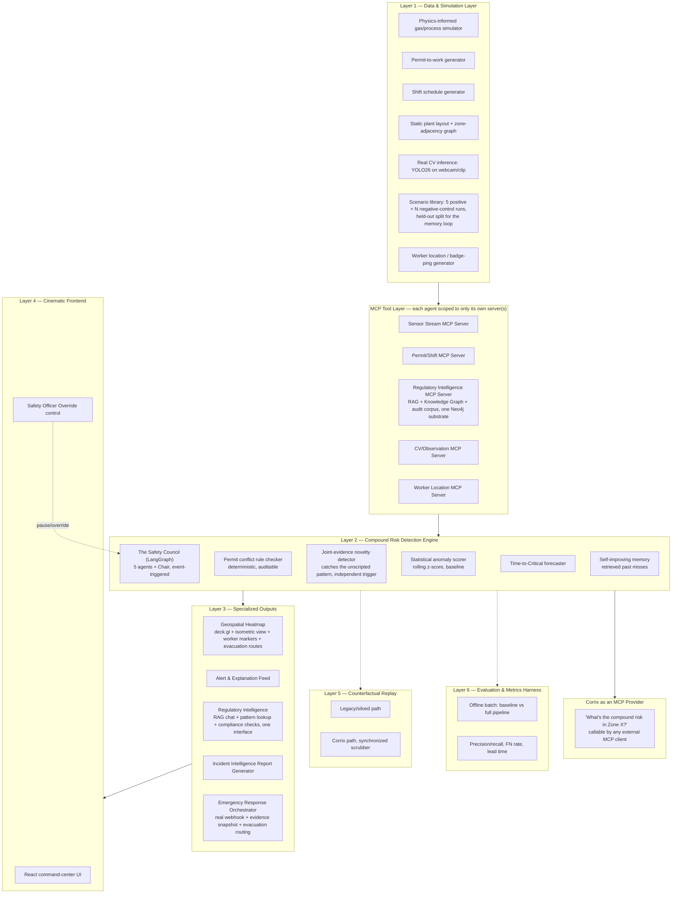

# Corrix
### The Correlation Layer Industrial Safety Never Had

**Problem Statement 1 — AI-Powered Industrial Safety Intelligence for Zero-Harm Operations**
*(Industrial Intelligence / Worker Safety / Geospatial Safety Analytics)*

> "Data present, but unacted upon." — the failure pattern Corrix is built to end.

---

## 0. How to Read This Document

This is the single source of truth for **what Corrix is, why we're building it this way, and what "done" looks like.** It supersedes the team's original `SentinelGrid_Project_Playbook_7Day.docx` in name and in several important respects — most of that playbook's engineering instincts were good, and we keep them. What changes:

1. **The product name is Corrix, not SentinelGrid.** SentinelGrid is retired as a working title.
2. **There is no 7-day ceiling.** We are not scoping down to fit 36 hours or a week. We scope up to what makes the strongest possible entry, and we build all six of the problem statement's official sub-directions as real, working, live-demoed features — not five-plus-a-roadmap-slide.
3. **One factual correction to the original playbook's anchor incident** (Section 3 below) — this matters a lot given our own "radical honesty" positioning, so it's addressed head-on, not buried.
4. **The tech stack is upgraded to 2026-current, free-tier-friendly, "new-age" tooling** — LangGraph + MCP for agent orchestration, a Groq/Gemini hybrid inference layer, Neo4j GraphRAG as a unified knowledge substrate, and three genuinely new flagship features that go beyond what any version of the playbook proposed.

Everything below is designed to be defensible under hostile judge questioning. Where a claim is uncertain or unverifiable, it is labeled as such — that labeling is itself part of the strategy (Section 15).

---

## 1. Executive Summary

**Corrix** is an AI-powered industrial safety intelligence platform that fuses gas/process sensor readings, permit-to-work records, shift schedules, computer-vision site observations, and plant geospatial layout into a single reasoning layer. It detects **compound risks** — dangerous combinations of ordinary-looking conditions that no single sensor, system, or team would flag alone — and surfaces them to a safety officer with a lead time measured in minutes, with full explainable reasoning, before they cross into an incident.

At its core is **the Safety Council**: five specialized AI agents that independently evaluate the same incident from different professional perspectives (process safety, permit control, shift operations, site observation, and a synthesizing Chair), reach a visible, auditable consensus, and — for the first time in any version of this project — **get measurably better over time** by learning from their own near-misses and false calls.

Corrix is not a dashboard with a red light. It is a reasoning system that shows its work, proves its accuracy against a labeled test library, and is honest on stage about exactly what part of it is real inference versus calibrated simulation — because no team building this problem statement has access to real Indian plant SCADA data, and pretending otherwise is a bigger risk than admitting it.

Everything else this platform does — all six official sub-directions built for real, a quantified Evaluation Harness, dual-role MCP integration — is real, load-bearing engineering, and it's all detailed below. But it's supporting proof, not the headline. The headline is a short list of things that are actually hard to find in another team's submission:

### What makes Corrix different, at a glance

| | |
|---|---|
| **A five-agent Safety Council with genuinely siloed access**, not a single model and not four personas sharing one context | Each agent can only query the MCP data source its real-world counterpart would have; only the Chair sees the fused picture, so the compound-risk thesis is true at the architecture level, not just narratively |
| **A Joint-Evidence Novelty Detector — catching the unscripted pattern** | The brief names three specific compound-risk patterns verbatim across its six illustrative categories; our five authored scenarios cover all three plus two more. Corrix also catches what nobody wrote down at all — a statistically unusual combination across the full evidence space that matches none of our known patterns — and we prove it live, on stage, with an unrehearsed combination (Section 6.7) |
| **A live Counterfactual Replay** | Side-by-side: what the old, disconnected systems would have seen vs. what Corrix catches, with real lead time |
| **A self-improving memory loop, proven on held-out data** | Missed and near-miss cases are fed back as retrieved exemplars; the false-negative-rate improvement is measured only on cases never used to populate the memory index — a generalization claim, not a memorization trick |
| **A live "Time-to-Critical" forecast, via Monte Carlo rollout** | Not just "risk is HIGH now" — a per-zone probability band ("68% chance of CRITICAL within 15–22 min"), reusing the same calibrated process model as the simulator, which is literally what the brief's own evaluation focus asks for: *prediction lead time before incident threshold* |
| **Live worker-location tracking + risk-aware evacuation routing** | The brief's own Geospatial Heatmap bullet names "worker location data" explicitly; on a CRITICAL verdict, Corrix computes and highlights a shortest path out that actively avoids other unsafe zones |
| **A real regulatory RAG layer** | Grounded in the actual public OISD guideline PDFs, the Factories Act 1948 text, and DGMS circulars (supplementary, honestly scoped) pulled from `oisd.gov.in`, `indiacode.nic.in`, and `dgms.gov.in` — not fabricated citations |
| **Full radical honesty** | Every synthetic component is labeled as synthetic, every real component is labeled as real, and we lead with that rather than hide it |

---

## 2. Why This Problem, Why This Shape of Solution

### 2.1 The core insight (unchanged from the brief, and correct)

Indian heavy industry typically runs five or more safety-relevant systems that are each individually competent and collectively blind to each other:

| System | What it tracks | What it does *not* know |
|---|---|---|
| Gas / IoT sensors | Real-time gas concentration/pressure per zone | Whether a work permit is active nearby |
| SCADA | Process control parameters | Permit status; human activity in the zone |
| Permit-to-work system | Who is authorized to do what, where, when | Live sensor conditions in that same zone |
| CCTV | Visual record of activity | Sensor readings; permit status |
| Shift / maintenance logs | Historical work and maintenance record | Real-time correlation with current conditions |

Danger routinely emerges from the **intersection** of two or more of these — not from any one crossing a threshold on its own. A rising gas reading is routine. A hot-work permit is routine. A hot-work permit issued in a zone where gas readings are simultaneously trending upward, right before a shift changeover, is a compound risk that no single system is designed to catch. This is the exact thesis printed in the official problem statement, and it is correct — nothing about our research changed this diagnosis. It's *why* we chose a fusion-and-reasoning architecture over a single detection model of any kind.

### 2.2 Why not a simpler solution

We deliberately ruled out three simpler shapes, and we should be ready to explain why if asked:

- **A single-model anomaly detector (e.g., one LSTM over all sensors).** This treats the problem as a pattern-recognition problem in one signal, when it's actually a cross-source *reasoning* problem. A deep sequence model also needs training volume we don't have, is harder to explain to a safety officer, and is higher-risk in a live demo. Wrong tool for this constraint set.
- **A pure computer-vision safety platform** (the Voxel / Protex AI / Intenseye / Everguard shape — see Section 4). These are strong, funded, real products, but they are fundamentally *behavior-based safety cameras*: PPE compliance, near-miss posture, vehicle proximity. None of them fuse permit-to-work state, process/SCADA trend, and shift context into one predictive layer for *process safety* incidents like gas entrapment. That's a different problem, and it's the one this brief is actually asking about.
- **A rule-engine-only system.** Deterministic rules (Section 5's permit-conflict checker) are essential for the auditable, explainable core but can't elegantly express the *judgment call* a human multi-disciplinary safety review makes — "none of these three things alone is a problem, but together, right now, they are." That synthesis step is exactly what the Safety Council's Chair agent does, and it's why this is a hybrid system, not a pure-ML or pure-rules one.

### 2.3 Why a multi-agent Council instead of one "smart" LLM call

Real industrial incident reviews are multi-disciplinary by design — a process engineer, a permit officer, and an operations lead each look at the same event through a different lens, and disagreement or convergence between them *is* the signal. A single LLM prompted to "assess this situation" collapses that structure into one undifferentiated judgment and hides exactly the reasoning a safety officer needs to trust the output. Mirroring the real review structure as separate agents makes the reasoning auditable per-perspective, not just per-verdict — and it happens to also be the single most visually compelling thing we can put on stage (Section 6.1).

---

## 3. The Anchor Incident — Corrected and Verified

This section exists because it matters more than any other paragraph in this document to our credibility strategy, and because the original playbook got a material detail wrong.

### 3.1 What the official problem statement says

> "...eight workers died at Visakhapatnam Steel Plant in January 2025 when entrapped gases triggered a sudden explosion in the coke oven battery — a facility that had functioning safety systems including gas detectors, permit-to-work controls, and SCADA. An investigation by The Wire found that warning signals from gas pressure sensors existed, but no intelligence layer connected those readings to operational decisions in time."

### 3.2 What our research actually found

There is a real, well-documented, multi-source-confirmed Visakhapatnam Steel Plant fatality event matching almost this exact description — **but it happened on 8 June 2025, not January 2025, and the mechanism was a molten-steel ladle, not a coke oven gas detector.**

- **What happened:** During a lifting/casting operation at Steel Melting Shop-2 (SMS-2), a ladle carrying molten steel at ~1,500°C was being rotated and positioned for casting when **entrapped gases within the molten steel caused a sudden explosion**, tipping the ladle. Eight workers below were killed; six more were injured, two critically.
- **Who investigated it:** A preliminary investigation by the Chief Inspector of Factories, Andhra Pradesh, attributed the explosion to gas entrapped in the liquid steel.
- **The Wire's own headline** on this event is: *"Entrapped Gases and Sudden Explosion: Here's How Eight Workers Died in Visakhapatnam Steel Plant"* — which is where the problem statement's phrasing almost certainly comes from.
- We could **not** independently verify a separate January 2025 coke-oven-battery explosion at the same plant involving gas pressure sensors, permit-to-work systems, and SCADA as described. The closest matching coke-oven event we found in public reporting is a smaller February 2025 fire at Coke Oven Battery-2 with one injury — a materially different, much less severe incident.

**Our read:** the problem statement's authors almost certainly adapted the real, verified June 2025 SMS-2 ladle incident into a dramatized "coke oven / gas sensor / SCADA" framing for narrative punch, or conflated it with a different, smaller event. That's a reasonable thing for a hackathon brief to do — it isn't our job to relitigate the organizers' brief — but it means we should **not** present the exact "gas detectors + permit-to-work + SCADA, January 2025" version as an independently-verified fact if a technical judge fact-checks it live, because a search turns up a different, real incident with different specifics.

### 3.3 How Corrix handles this on stage

We use the **real, verified** incident as our anchor, and we cite it precisely:

> "On June 8, 2025, eight workers at Visakhapatnam Steel Plant died when entrapped gases inside a ladle of molten steel triggered a sudden explosion during a routine casting operation — a preliminary investigation by the Chief Inspector of Factories confirmed the cause. The signal — gas entrapment in an in-process vessel — existed in the physical system. No layer connected that condition to the fact that a lifting/casting operation was actively underway in that exact location, at that exact moment. That is the precise failure mode Corrix is built to close, generalized across gas sensors, permits, shift timing, and process state — not just this one vessel type."

This is *more* defensible than the brief's own framing, not less — it's independently checkable against three-plus outlets, it doesn't require us to claim a coke-oven/SCADA detail we can't source, and it still lands the exact same thesis the judges are looking for: **a real signal existed, nothing fused it with operational context, and people died in the gap.** If a judge has read the brief closely and asks about the discrepancy, the honest answer ("we verified the brief's framing against public reporting, found the real incident was dated differently and involved a ladle rather than a coke oven, and we cite the version we could confirm") is a credibility *gain*, in the same spirit as our synthetic-data disclosure (Section 12).

### 3.4 National-scale statistics — what's solid, what needs a caveat

| Statistic (as used in the brief) | What we could verify | How we cite it |
|---|---|---|
| "6,500+ fatal workplace accidents in FY2023" | A 2021 government reply to Parliament cited 6,500+ deaths across factories, mines, ports, and central-government sites **over the preceding five years** (2016–2021), not FY2023 alone. FY2023's own fatality rate (5.46 per lakh workers) was reported as a slight *decline*. | Cite as: *"as referenced in the official problem statement"* rather than as an independently-sourced FY2023-only figure. Pair it with the figures we *could* verify (below) for a stronger, defensible number. |
| "Over 60% of large industrial facilities rely on manual handoffs" (FICCI 2024) | Not locatable in public FICCI survey archives during our research pass. | Cite as: *"as referenced in the official problem statement"* — do not present as independently re-verified. Flag as an action item if a teammate has the original source PDF the organizers used. |
| India records **one serious industrial accident roughly every two days** in registered factories; accident rate of **~8,700 per 100,000 workers** | Independently corroborated across multiple sources. | Cite directly, with source. |
| In complex industrial sectors, **indirect-to-direct incident cost ratio can reach 20:1** (investigation, downtime, morale, replacement training, regulatory exposure — beyond direct medical/compensation cost) | Corroborated industry-standard framing (OSHA / National Safety Council cost models, echoed in Indian coverage). | Use for the Business Impact narrative (Section 13), not as an India-specific measured figure. |

This is a small, deliberate correction — but it's exactly the kind of due diligence a judge evaluating "business impact" and "technical excellence" rewards, and it costs us nothing to get right up front instead of getting caught out live.

---

## 4. Competitive Landscape — Where Corrix Actually Sits

A judge who has seen a few of these pitches before will reasonably ask "isn't this just Intenseye/Protex AI/Voxel?" The honest answer is no, and it's worth being precise about why, because it's a real differentiator, not just a talking point.

| Product | What it actually is | What it does *not* do |
|---|---|---|
| **Intenseye** | CV-first workplace safety platform; real-time hazard detection across 50+ unsafe-act categories from existing cameras; backed by $64M Series B | No permit-to-work fusion, no SCADA/process signal correlation, no compound-risk reasoning across data types |
| **Protex AI** | Hybrid edge + cloud CV safety platform; configurable computer-vision rules | Same gap — CV-centric, not a cross-system fusion/reasoning layer |
| **Voxel** | Broad CV coverage (PPE, ergonomics, vehicle safety, area controls); deploys on existing camera infra in ~48 hours | Same gap |
| **Everguard.ai (Sentri360)** | Closest of the four to Corrix's ambition — combines CV, wearables, RTLS, and IoT sensor inputs for a broader risk picture | Still framed around worker-location/behavior risk, not permit-vs-process-condition compound reasoning grounded in regulatory text, and no public evidence of an LLM reasoning/explanation layer or an evaluation harness |

**The whitespace Corrix occupies:** none of the well-funded incumbents fuse *permit-to-work state* + *process/SCADA trend* + *shift context* + *regulatory grounding* into one explainable predictive layer for **process safety** incidents (gas entrapment, confined space, hot work near hazard) — as opposed to **behavior safety** incidents (missing PPE, unsafe posture, forklift proximity). Those are genuinely different problems with different failure signatures, and the Vizag-class incident is a process-safety failure, not a behavior-safety one. This is precisely the gap the official problem statement is pointing at, and it's a legitimate, defensible market gap — not just hackathon framing.

---

## 5. System Architecture



### Layer summaries

- **Layer 1 — Data & Simulation:** Physics-informed sensor simulation (an Ornstein-Uhlenbeck baseline plus an injectable leak/accumulation source term, see Section 12), permit/shift/worker-location generators, and one genuinely real subsystem: a fine-tuned open CV model running on live or sample footage.
- **MCP Tool Layer (new):** Every data subsystem — sensor stream, permits/shifts, worker location, the Regulatory Intelligence substrate (RAG + knowledge graph + audit corpus, unified), and CV observations — is exposed as a standard **Model Context Protocol** server rather than a bespoke function-call integration per agent, and **each Safety Council agent is scoped to only the server(s) its real-world counterpart would have** (Section 6.1) — this is both the biggest "new-age" architectural upgrade over the original playbook (Section 7.2) and the mechanism that makes the compound-risk thesis structurally true, not just narratively true.
- **Layer 2 — Compound Risk Detection Engine:** The statistical/rule-based fast path (unchanged, still the right tool — Section 2.2) feeding into the Safety Council, now orchestrated as a **LangGraph** state machine rather than an ad hoc prompt chain, plus a **joint-evidence novelty detector** running as a second, independent trigger for combinations no rule or scenario was scripted to catch, and two further new components: a **Time-to-Critical forecaster** and a **self-improving memory** retrieval step (Section 6).
- **Layer 3 — Specialized Outputs:** Five output modules, consolidated deliberately rather than split into one box per brief bullet — the Regulatory Intelligence module alone answers three of the six official sub-directions (Incident Pattern Intelligence, Quality & Compliance Audit, and part of the regulatory-grounding story) through one interface instead of three disconnected panels (Section 8).
- **Layer 4 — Cinematic Frontend:** The command-center UI (Section 11), now with a **Safety Officer Override** control that is a real LangGraph interrupt, not a cosmetic button.
- **Layer 5 — Counterfactual Replay** and **Layer 6 — Evaluation Harness:** Both flagship differentiators, kept, because they directly answer the brief's own "Evaluation Focus" language (ground truth defined precisely in `CORRIX_DATA_METHODOLOGY.md` §14).
- **Corrix as an MCP Provider (new):** The compound-risk state itself is exposed back out as an MCP server, so any external agent or tool (imagine a judge's own Claude/Gemini session, or a plant's existing ServiceNow/Slack integration) can query it directly — a genuinely two-directional integration story (Section 7.2).

---

## 6. The Safety Council — Core Intelligence

### 6.1 The five agents

| Agent | Perspective | Primary evidence weighted |
|---|---|---|
| **Process Safety Engineer** | Is the physical/process condition abnormal? | Sensor anomaly trend, rate of change, OU-model deviation from baseline |
| **Permit Control Officer** | Is authorized work compatible with current conditions? | Active permits vs. zone hazard state, permit-type conflict rules |
| **Shift Operations** | Is human-factors risk elevated right now? | Changeover proximity, handoff windows, workload/time-of-day context |
| **Site Safety Observer** | Does the site-observation signal corroborate or contradict the other evidence? | Real CV detection events (person/PPE presence) + simulated permit-correlation layer, clearly separated |
| **Chair (synthesis)** | What's the compound verdict, and is this risk arising *specifically* from the combination? | All four other agents' structured output + retrieved similar past cases (Section 6.3) |

**Each agent is restricted, by MCP tool scoping, to only the data source its real-world counterpart would actually have.** The Process Safety Engineer can query only the Sensor Stream MCP server. The Permit Control Officer can query only Permit/Shift. The Site Safety Observer can query only CV/Observation. None of them can see the others' raw evidence directly — only the Chair receives all four structured outputs and synthesizes across them. This is a deliberate correction from an earlier draft of this design, where all four agents shared one evidence context: that version let any single agent theoretically notice the compound pattern on its own, which quietly undercuts the entire thesis. With scoped access, "the compound risk only emerges from fusion" is true at the architecture level, not just true in the pitch — it's the same silo structure that caused the real anchor incident, mirrored deliberately rather than asserted.

Their assessments render live in the UI as a short structured exchange before the Chair issues a final verdict with a stated confidence level — this is both the most trust-building and the most visually compelling thing in the product.

### 6.2 Verdict schema (unchanged core design — it was already good)

```json
{
  "zone_id": "Z1",
  "scenario_id": "S1",
  "trigger_reason": "rule_threshold",
  "timestamp": "2026-07-19T10:32:00Z",
  "council": {
    "process_safety_engineer": "Gas readings 18% above baseline, rising",
    "permit_control_officer": "Hot work permit P-2291 active in Zone 1",
    "shift_operations": "Changeover begins in 12 minutes",
    "site_safety_observer": "Personnel detected in Zone 1 without a matching permit badge scan"
  },
  "risk_level": "HIGH",
  "confidence": 0.87,
  "compound_flag": true,
  "time_to_critical_minutes": 18,
  "explanation": "No single factor alone crosses a critical threshold. The combination matches the compound-risk pattern verified in the June 2025 Visakhapatnam Steel Plant SMS-2 investigation.",
  "recommended_action": "Suspend permit P-2291 pending gas verification; notify Zone 1 supervisor before shift handoff."
}
```

Two schema additions beyond the original design: `time_to_critical_minutes` (Section 6.4) and `trigger_reason` (Section 6.7) — `"rule_threshold"` for the normal path shown above, or `"novelty"` when the joint-evidence novelty detector convened the Council instead of a scripted rule or scenario match.

### 6.3 New: Self-improving memory (retrieval-based, not fine-tuning)

Every run through the Evaluation Harness (ground truth defined in `CORRIX_DATA_METHODOLOGY.md` §14) produces labeled outcomes: true positives, false positives, false negatives, near-misses. Rather than leaving those results as a static report, Corrix stores each **miss** (false negative or a late true positive) as a structured exemplar — the evidence state, the verdict that *should* have been reached, and why — in the same vector/graph substrate used for RAG (Section 7.1). On every new Council convening, the Chair retrieves the 1–2 most similar historical misses before synthesizing its verdict, effectively giving it a working memory of its own past mistakes.

This is deliberately small and honest: it is **not** claiming reinforcement learning or model fine-tuning, which would be both unnecessary and hard to verify live. It's a retrieval-augmented self-correction loop.

**The proof has to survive an obvious challenge, so it's built to survive it.** If the "before/after" comparison were run on the same runs that populated the memory index, any improvement would just be memorization, not learning — and that's exactly the question a sharp judge would ask. So the scenario library is partitioned in advance into a **memory-population set** and a **held-out evaluation set** that never contributes exemplars (mechanics in `CORRIX_DATA_METHODOLOGY.md`). We re-run the Evaluation Harness before and after the memory loop is populated, but **report the false-negative-rate change only on the held-out set.** That's a real, measured "the system generalized, not just memorized" moment — something almost no competing team will have, because almost no competing team will have an evaluation harness, let alone a held-out split, to make the claim honestly in the first place.

### 6.4 New: Live Time-to-Critical forecasting

The brief's own "Evaluation Focus" line explicitly names *prediction lead time before incident threshold* as a judged metric. The original playbook measured lead time only after the fact, in the offline harness. Corrix also surfaces it **live, per zone, in the UI**, as a running forecast — and it's a genuine forecast, not a naive straight-line extrapolation. Because every zone signal is already modeled as a calibrated stochastic process (the OU model, `CORRIX_DATA_METHODOLOGY.md` §3), we can reuse that exact same process simulator as a forecaster: from the current observed state, roll forward a few hundred independent stochastic future paths using the same calibrated parameters, and record when each one crosses the HIGH/CRITICAL threshold. The result is a real distribution, not a point guess — displayed as *"Zone 1: 68% chance of reaching CRITICAL within 15–22 min at current trend"* rather than a bare, falsely-precise "18 min." This is a cheap addition (it's the same stepping function already built for the simulator, run forward instead of scripted) and a materially more honest one: it surfaces uncertainty instead of hiding it, which is itself a credibility signal to a technical judge, and it directly demonstrates the predictive (not just detective) framing the brief asks for.

### 6.5 New: Safety Officer Override

Because the Council is orchestrated as a LangGraph state machine with native checkpointing, a human Safety Officer can pause the Council mid-reasoning, inject a note ("permit P-2291 was already suspended manually 5 minutes ago"), and resume — the Chair incorporates that human input into its synthesis rather than the system overriding a human decision blindly. This is a genuine trust/adoption feature grounded in a real requirement: operators will not trust or act on a system that can't be corrected by a human in real time, and it's a distinctive, concrete UX moment for the demo.

**Corrix is a decision-support system, not an autonomous control system.** It never issues a command that shuts down equipment or overrides a human operator unilaterally — the Emergency Response Orchestrator (Section 8) notifies and documents; it doesn't act on the plant directly. The Override control exists precisely because the final call always sits with a human, which is both the honest engineering answer and the one that matches how a real safety-critical system would actually be allowed to deploy.

### 6.6 New: Risk-Aware Evacuation Routing

The Geospatial Safety Heatmap sub-direction (Section 8) is explicitly about "situational awareness," and the Emergency Response Orchestrator's own stated goal is turning "the critical first 10 minutes from chaos to coordinated response." Both of those are stronger claims if the system can answer a safety officer's first real question during an incident — *who is actually in the affected zone, and what's the safest way out* — rather than just changing a zone's color.

Corrix answers this using data it already has: the worker-location stream (Section 8, `CORRIX_DATA_METHODOLOGY.md` new §8) gives live zone occupancy, and the zone layout already includes an adjacency graph. On a HIGH/CRITICAL verdict, a Dijkstra shortest-path search runs over that adjacency graph — with edge weights inflated for any zone currently in an elevated risk state, so the path actively avoids other unsafe zones rather than just finding the geometrically shortest route — from the affected zone to the nearest safe assembly point. The resulting path renders as a highlighted route on the heatmap and is attached to the ERO's fired notification and the Incident Report. This is a small addition (one well-known algorithm over a graph we already have) that converts "the map looks dramatic" into "the map produced an actionable instruction," which is the more defensible version of the same feature.

### 6.7 New: Joint-Evidence Novelty Detection — Catching the Unscripted Pattern

Here's a question a sharp judge should ask, and that we asked ourselves: the brief's six illustrative sub-directions name exactly **three** specific compound-risk patterns verbatim, not six — maintenance activity co-occurring with gas accumulation (in the Challenge Statement itself), confined space entry during abnormal process conditions (the Compound Risk Detection Engine bullet), and hot-work permits near elevated gas readings (the Digital Permit Intelligence Agent bullet). Every competent team will build for at least those three, since they're explicitly named — ours are S2, S3, and S4. We went further: five authored scenarios total, covering the brief's three plus the real anchor case plus one purpose-built to prove the memory loop generalizes. But **what happens with a combination nobody wrote down — not the brief's three, not our five, including us?** If the honest answer is "we don't catch it," the whole "compound risk" pitch quietly reduces to "we memorized a fixed list," which is a real vulnerability under close questioning, not just a hypothetical one.

**The mechanism.** Running alongside the Council's rule/threshold-triggered path (Section 6.1), a second, independent trigger is a **novelty detector** over the full joint evidence vector — sensor state, permit state, shift state, worker-location/CV state, all together, not per-signal. It's trained on exactly the data we already generate in volume for a different reason: the negative-control ("normal day") runs required for a fair Evaluation Harness (`CORRIX_DATA_METHODOLOGY.md` §12.4) are also, for free, a reference distribution of what a *normal* joint plant state looks like. A lightweight density/reconstruction model (a small autoencoder, or even a simpler Mahalanobis-distance score against a fitted distribution — the simplest model that works is the right choice here, not the most elaborate one) is fit to that reference set. At runtime, every evidence snapshot is scored against it. A high novelty score convenes the Council **even when no individual rule or threshold fired** — this is the whole point: it's a second, independent path to escalation, not a restatement of the first one.

When a novelty-triggered case reaches the Chair, the verdict schema (Section 6.2) carries an honest `trigger_reason: "novelty"` tag rather than pretending to recognize a named pattern — the explanation becomes *"this combination doesn't match any known compound-risk pattern, but its statistical profile is unusual enough to warrant review,"* which is a more sophisticated and more honest thing for a safety system to say than always claiming pattern recognition.

**Proving it, not just claiming it — "The Open Challenge."** Because the underlying scenario engine is config-driven, not five fixed scripts (`CORRIX_DATA_METHODOLOGY.md` §12.1), Corrix can assemble a valid, novel evidence combination on demand from parameters specified live — including, deliberately, parameters we pick during the demo itself rather than pre-rehearsing. The strongest possible proof that this isn't just five memorized patterns is showing it catch a combination it was never scripted for, live, in front of judges. Most teams won't risk an unscripted live test because their systems are narrowly pattern-matched; being able to credibly do the opposite is itself a signal. In practice this is run as a **curated-random** device, not raw improvisation with no safety net: a set of valid-but-unscripted combinations is pre-generated and pre-validated (so we know the novelty detector handles them correctly) and one is drawn live, semi-randomly, during the demo — genuinely unrehearsed for that specific run, but not a live production system with zero rehearsal margin. That distinction is worth stating plainly if asked, rather than overselling the risk we actually took.

---

## 7. New-Age Tech Stack

### 7.1 Why each choice, not just what

| Layer | Technology | Why this, specifically, in 2026 |
|---|---|---|
| Backend framework | Python + FastAPI | Native WebSocket support, fast to build, still the default choice for this shape of system |
| **Agent orchestration** | **LangGraph** | Of the mainstream frameworks (LangGraph, CrewAI, AutoGen/Microsoft Agent Framework, Google ADK), LangGraph is the most production-battle-tested option with native state checkpointing, interrupts, and "time travel" — which is exactly what the Safety Officer Override (6.5) and Counterfactual Replay (9.1) need structurally, not just conceptually. CrewAI is easier to learn but suits sequential task delegation better than a "convene, debate, converge, allow interrupt" flow. AutoGen was folded into the Microsoft Agent Framework in 2025 and is no longer the actively-developed option it was — a deliberate reason to avoid it, worth stating if asked. |
| **Tool/data access** | **Model Context Protocol (MCP)** | By mid-2026 MCP has over 10,000 active public servers and native support across Anthropic, OpenAI, Google, and Microsoft's flagship models, with LangGraph, CrewAI, and LlamaIndex all defaulting to it for tool-calling. Wrapping each data subsystem (sensor stream, permits, the unified Regulatory Intelligence substrate, CV) as an MCP server — instead of bespoke per-agent function calls — means any future agent framework, or an external tool a judge already uses, can plug in without custom glue code. It's also what makes the "Corrix as an MCP provider" story (7.2) possible at near-zero extra cost. |
| Agent interoperability (roadmap) | Google ADK + the A2A (Agent-to-Agent) protocol | Not required for the demo, but worth naming: ADK's A2A support means a Council agent could, in production, be discovered and invoked by a plant's existing Vertex AI/ADK-based systems, or vice versa — a credible, concrete answer to "how does this integrate with what a real plant already runs," beyond the generic "microservices" answer most teams give. |
| **LLM inference (primary)** | **Groq**, free tier (Llama 4 Scout / Qwen3 32B / DeepSeek R1 Distill) | 500–3,000+ tokens/sec, sub-second first-token latency, 30 RPM / 14,400 requests-per-day free — more than enough for event-triggered Council convenings and for running the full Evaluation Harness batch quickly. Speed here isn't a nice-to-have: a live demo where the Council visibly "convenes" needs to resolve in a couple of seconds to read as intelligence, not lag. **The actual budget:** one Council convening is 5 calls (4 agents + Chair). A demo cycling through 3 scenarios plus Q&A follow-ups is comfortably under 30–40 calls in a short window — well inside Groq's 30 RPM. |
| **LLM inference (secondary / multimodal)** | **Gemini** (2.5 Flash / Flash-Lite), free tier | Free, no-card-required tier (up to 15 RPM / 1,000 requests-per-day on Flash-Lite), native multimodal input — used for the CV-grounding commentary path and as an automatic failover if Groq's rate limit is hit mid-demo. This satisfies "use free APIs like Gemini" concretely: Gemini is in the stack, paired with Groq for latency-critical paths rather than relied on alone. Gemini's free tier (15 RPM) is noticeably tighter than Groq's — it stays a genuine fallback, never a 50/50 load-balanced co-primary, or a live demo risks a 429 on the tighter path. |
| **Knowledge substrate (RAG + KG, unified)** | **Neo4j AuraDB (free tier) + `neo4j-graphrag-python`** | The original playbook split this into ChromaDB (vectors) + NetworkX (graph, in-memory, non-persistent). Neo4j's 2026.01+ native vector search (via the Cypher `SEARCH` clause) means one free, persistent, real database serves both the equipment–permit–zone–incident graph *and* the OISD/Factories Act vector-retrieval corpus — fewer moving parts, and "we run GraphRAG on a real graph database" is a stronger technical-excellence claim than "we keep a graph in a Python dict." |
| Regulatory source documents | **Real PDFs, sourced directly**: OISD guideline documents from `oisd.gov.in`, the Factories Act, 1948 full text from `indiacode.nic.in` and `dgms.gov.in`, plus **DGMS safety circulars** (supplementary — see honest-scoping note below) | These are verified, live, public government sources — no placeholder text, no fabricated citations. Direct URLs are logged in Section 16 so a teammate can pull them immediately. |
| Computer vision | **YOLO26** (or YOLOv11 if inference speed on demo hardware matters more than the marginal accuracy gain), fine-tuned on the **Ultralytics Construction-PPE** open dataset | YOLO26 is the current-generation Ultralytics release (Jan 2026); the open Construction-PPE dataset (1,416 images, 11 classes — helmets, gloves, vests, boots, goggles) is real, free, and license-compatible for a hackathon build. Real inference on live/sample footage, clearly separated in the UI from the simulated zone-correlation layer on top of it (Section 12.6). |
| Geospatial visualization | **React + deck.gl** (GPU-accelerated layers for the live heatmap, zone states, and live worker-location markers) + a custom CSS/SVG **isometric transform** (cheap, reliable signature moment) | deck.gl is the standard choice for large, dynamic geospatial data layers in a React app. A full 3D globe/terrain "Digital Twin" mode (e.g. CesiumJS) was considered and deliberately cut from active scope — it was the single largest optional time investment in the original plan for a payoff no judging criterion specifically rewards, and the deck.gl + isometric combination already fully answers the "Geospatial Safety Heatmap" sub-direction once worker-location markers and evacuation-route overlays (Section 6.6) are on it. It's noted in the roadmap (Section 16) as a real future option, not built here. |
| Notifications (ERO) | Slack / Discord / SMTP webhook | Unchanged — a real message fires, judges see it land, no reason to change a working idea. |
| Report generation | HTML → PDF (e.g., WeasyPrint) | Unchanged. |
| Evaluation harness | Python + Pandas, batch script | Unchanged — still the correct tool; this is a results table, not a live-demo dependency. |
| Hosting | **Local-first for the live demo** (avoids connectivity risk) + a public **Render or Railway** free-tier instance for judges to explore asynchronously | Render/Railway both support persistent FastAPI + WebSocket processes on a free tier (with a cold-start delay on Render, worth warming up before a judge visits) — Vercel's serverless model does not suit a stateful WebSocket backend, so it's deliberately not used here. |

### 7.2 Corrix as a dual-role MCP citizen

Most teams that use "agentic AI" this cycle will mean "an LLM calls a couple of Python functions." Corrix goes one step further in a way that's genuinely inexpensive to build but reads as materially more sophisticated: every internal data subsystem is exposed as an MCP *server* that the Safety Council consumes as a *client* — and the Council's own compound-risk state is, in turn, exposed as an MCP server that anything else can consume. Concretely: a judge could, in principle, point their own Claude or Gemini session at Corrix's MCP endpoint and ask "what's the current compound risk in Zone 4 and why" and get a live, grounded answer — without us having built a bespoke chat integration for that purpose. It's the same underlying interface the Council itself uses internally. That symmetry is the point, and it's a strong, concrete answer to the "Scalability" judging criterion (15%): integration into an existing enterprise stack isn't a roadmap slide, it's the same protocol already wired in.

### 7.3 Honest scoping: why DGMS is in the corpus, and why only supplementarily

The brief's own Evaluation Focus line names three regulatory frameworks — OISD, the Factories Act, and DGMS. Our RAG corpus originally covered only the first two; that's a real gap against the judges' own rubric, not just a nice-to-have. DGMS (Directorate General of Mines Safety) statutorily governs mining operations under the Mines Act, 1952 — not, strictly, the downstream steel-processing zones (coke ovens, ladle bays, maintenance shops) our layout models. Rather than force an ill-fitting citation, DGMS's general safety circulars are included as **supplementary** grounding, on the honest basis that integrated steel plants of this kind typically run captive raw-material/mining supply chains (loosely reflected in Zone 5, the Raw Material/Scrap Yard) that genuinely do fall under DGMS jurisdiction — and because the rubric explicitly asks for it. The specific circular(s) are sourced and verified against `dgms.gov.in` at build time with the same real-source-only discipline applied to OISD and the Factories Act (Section 18).

---

## 8. Four Pillars, Covering All Six Official Sub-Directions

Every sub-direction named in "What You May Build" is real, working, and live-demoed in Corrix — but they aren't built as six disconnected modules chasing a checklist. Six separate boxes competing for the same five minutes of demo time is worse than four that are actually integrated, and a team that visibly synthesized the brief's own examples into a coherent system reads as more sophisticated than one that built each bullet in isolation. So the six map onto **four pillars**:

| Pillar | Official sub-direction(s) it covers | What it actually is |
|---|---|---|
| **1. Compound Risk Detection** | Compound Risk Detection Engine; Digital Permit Intelligence Agent | The Safety Council (Section 6) + anomaly scorer + permit-conflict rule checker + the joint-evidence novelty detector (6.7). The permit intelligence bullet isn't a separate agent — it's the Permit Control Officer's evidence stream, a first-class input to the same engine, not a bolt-on. |
| **2. Geospatial Situational Awareness** | Geospatial Safety Heatmap | deck.gl live heatmap, isometric view, live worker-location markers, and risk-aware evacuation routing (7.1, 6.6) — one map, several live layers, not several maps. |
| **3. Regulatory Intelligence** | Incident Pattern Intelligence; Quality & Compliance Audit Agent | **One** Neo4j-backed layer serving both: a RAG chat grounded in real OISD/Factories Act/DGMS text answers "what does the regulation say," graph traversal over the same substrate answers "has this pattern happened before," and the identical retrieval mechanism checks a mocked inspection log against a live-retrieved checklist to flag a compliance deviation. Three brief-named capabilities, one interface, one database — not three separate agents with three separate UI panels. |
| **4. Emergency Response** | Emergency Response Orchestrator | Real webhook notification, timestamped/hashed evidence snapshot, risk-aware evacuation route, auto-attached to the Incident Report on CRITICAL verdicts. |

The real CV Site Safety Observer signal and the joint-evidence novelty detector (Section 6.7) are genuinely real/beyond-the-brief subsystems layered across the above (Section 12).

---

## 9. Flagship Differentiators — Full List

This list is deliberately short. Every item earned its place by being genuinely hard to find in another team's submission — everything that was merely solid engineering (all six sub-directions built, dual-role MCP, confidence calibration reporting) is real and detailed elsewhere in this document, but it's support, not headline. A pitch that leads with eight equally-weighted bullets is a pitch nobody remembers; a pitch that leads with these seven is one a judge can repeat back after the fact:

1. **The Safety Council** — five-agent, LangGraph-orchestrated, human-interruptible multi-agent reasoning with genuinely siloed information access (Section 6.1), not a single black-box model and not four agents quietly sharing one context.
2. **The Joint-Evidence Novelty Detector** (Section 6.7) — catches compound-risk combinations nobody scripted, not just the three the brief names or the five we built, and proves it with an unrehearsed live demonstration rather than a claim.
3. **A live Counterfactual Replay** — synchronized split-screen, legacy path vs. Corrix path, across all scenarios.
4. **A self-improving memory loop, validated on a held-out set** — measurably lower false-negative rate on cases the memory loop was never populated from, driven by retrieval over the system's own past misses on other cases.
5. **Live Time-to-Critical forecasting via Monte Carlo rollout** — a per-zone probability distribution, not a bare countdown, directly answering the brief's "prediction lead time" framing with honest uncertainty instead of false precision.
6. **Live worker-location tracking and risk-aware evacuation routing** on a cinematic command-center UI — situational awareness that produces an actionable instruction, not just a colored map.
7. **Radical, corrected honesty** — including the anchor-incident correction in Section 3, and the real/simulated disclosure in Section 12, presented as a strength rather than hedged.

Underneath these seven: all six official sub-directions are fully functional (Section 8, not five-plus-a-slide), the regulatory RAG layer is grounded in real OISD/Factories Act/DGMS source text, and Corrix's dual-role MCP integration (Section 7.2) means it both consumes plant data and exposes its own risk layer through the same open protocol. Real, working, and worth a sentence in the demo — just not the seven sentences judges are actually going to remember.

---

## 10. Scenario Library

| Scenario | Compound pattern | Source |
|---|---|---|
| **S1 — Anchor case** | Gas entrapment/accumulation trend + active permit + approaching shift changeover during a lifting/casting-type operation | Modeled on the verified June 2025 Vizag SMS-2 investigation (Section 3.3) |
| **S2 — Confined space entry** | Personnel entry into a confined space during abnormal process conditions | Named verbatim in the official problem statement |
| **S3 — Maintenance / gas co-occurrence** | Maintenance activity co-occurring with hazardous gas accumulation | Named verbatim in the official problem statement |
| **S4 — Hot work near elevated gas** | Hot-work permit issued in proximity to a zone with elevated, rising gas readings | Named as an example in the brief's Digital Permit Intelligence Agent bullet |
| **S5 — Silent sensor drift (near-miss)** | Slow, sub-threshold sensor drift that never crosses a hard threshold but matches a known historical near-miss pattern in the knowledge graph | Purpose-built to showcase the self-improving memory loop (6.3); several seeded variants exist, split between the memory-population set and the held-out evaluation set so the "the system learned" claim is tested on cases it never saw |
| **N1..Nk — Negative controls** | Normal operating day, no injected event, generated in matched volume to positive runs | Used to measure false-positive rate honestly |

Five positive scenarios — the anchor case, the three named directly in the brief, and one purpose-built to prove the memory loop generalizes — plus a matched negative-control set. A sixth, "multi-zone cascade" scenario was cut in review: it didn't demonstrate anything the other five don't already cover, and the Open Challenge (6.7) is now the mechanism that proves generalization *beyond* any fixed scenario count, which is a stronger claim than one more scripted variant would have been. Each remaining scenario has multiple seeded variants (`CORRIX_DATA_METHODOLOGY.md` §12), partitioned into memory-population and held-out subsets — this isn't five fixed demo scripts, it's five scenario *types* with a real train/held-out split underneath.

---

## 11. Visual & UX Design System

Kept from the original playbook — it was already a strong, deliberate choice, and nothing in our research suggested a better direction. Refinements only.

**Direction: "Industrial Command Center."** Dark-mode, glassmorphic, inspired by real mission-control and SCADA HMI software. Dark backgrounds make amber/red alert states read with real authority from a distance (judges may view from several feet or via a projector).

| Role | Color | Hex |
|---|---|---|
| Background (base) | Deep navy-black | `#0B1015` |
| Panel surfaces | Glass steel (semi-transparent navy) | `#1F3A5F @ 70%` |
| Primary accent | Cyan glow | `#00B4D8` |
| Safe state | Emerald green | `#2E7D32` |
| Caution state | Amber | `#FF8C00` |
| Critical state | Alert red | `#D62828` |
| Text (primary) | Near-white | `#EAF1F7` |
| Text (secondary) | Cool grey | `#8FA3B8` |

**Accessibility note:** the safe/caution/critical palette (green/amber/red) is a known problem for red-green color blindness (~8% of men). Every risk-state indicator pairs its color with a distinct icon/shape, not color alone — a cheap fix that costs one design pass and that most competing teams on this exact green/amber/red pattern won't bother with.

**Typography:** IBM Plex Mono / Space Grotesk for headings and data readouts (instrumentation feel); Inter for body text and regulatory-assistant chat.

**Signature moments to build deliberately:**
- Animated particle-based gas-dispersion overlay during an active event (not a flat color fill).
- Glowing, pulsing zone borders on HIGH/CRITICAL verdicts.
- A live "Council in session" micro-animation — five agent icons plus a Chair icon, with a brief reasoning indicator.
- Smooth, eased state transitions (green → yellow → orange → red), never instant snaps.
- The Counterfactual Replay split-screen with a synchronized scrubber, across all five scenarios.
- The Time-to-Critical forecast, rendered as a live probability band per zone (Section 6.4) — not a bare number buried in a tooltip.
- Live worker-location markers moving through zones, and a highlighted risk-aware evacuation route overlay when a CRITICAL verdict fires (Section 6.6).
- An isometric view toggle for the heatmap — the flat 2D view is always the tested, working default; the isometric mode is additive, never load-bearing for the core demo.
- A Safety Officer Override control that visibly pauses the Council mid-reasoning and resumes with the human's note incorporated.

**Layout:** main panel = geospatial heatmap with worker markers, evacuation-route overlay, and view-mode toggle; right panel = Safety Council live reasoning + Alert/Explanation feed; bottom drawer = Regulatory Intelligence chat (RAG + pattern lookup + compliance checks, one interface — Section 8); top control bar = Counterfactual Replay toggle, scenario selector (S1–S5) plus the Open Challenge trigger, Incident Report download, ERO trigger indicator, Override control; secondary tab = Evaluation Report, including the confidence-calibration reliability diagram.

---

## 12. Data Strategy, Realism, and Validation

> **Full engineering-level detail — exact formulas, parameter tables, per-scenario config schema, and the SWaT validation procedure — lives in the companion document `CORRIX_DATA_METHODOLOGY.md`.** This section is the summary; that document is the spec a teammate would actually implement from.

### 12.1 Why synthetic data, stated plainly

No public dataset of real Indian plant SCADA, gas-sensor, or permit-to-work data exists — this is proprietary, safety-sensitive information no company publishes, and every team addressing this problem statement faces the identical constraint. What differentiates Corrix is a physics-informed, externally-validated simulation methodology, disclosed with full transparency rather than hidden or apologized for.

### 12.2 Physics-informed simulation (unchanged — this was already the right idea)

Gas/process concentration is modeled with a mean-reverting Ornstein-Uhlenbeck baseline (representing normal ventilation/dispersion equilibrium) plus an injectable source term representing a scripted leak/accumulation/entrapment event:

```
dC/dt = -k(C - C_baseline) + S(t)

C            = concentration at time t
k            = ventilation/dissipation rate constant
C_baseline   = equilibrium concentration for the zone
S(t)         = source term (0 under normal conditions;
               positive during a scripted event)
```

### 12.3 New: external validation against a real industrial dataset

The original playbook's validation was entirely internal — "our numbers look reasonable, and our thresholds are shown on screen." Corrix goes one step further: we benchmark the **statistical shape** of our simulator's normal-operation output (noise characteristics, autocorrelation, baseline drift) against the publicly available **SWaT (Secure Water Treatment) dataset** — a real, widely-used industrial control system testbed dataset (51 sensor/actuator tags, sampled every second, 7 days of normal operation plus 4 days of injected-attack anomalies, from iTrust SUTD). We are not claiming our plant *is* a water treatment plant — the point is narrower and more defensible: it shows our synthetic sensor noise and drift characteristics were checked against how a real, physical industrial control system actually behaves, rather than tuned purely by eye. This is the kind of detail that separates "we simulated data" from "we validated our simulation methodology," and almost no competing team will have done it.

### 12.4 Simulated plant layout (unchanged)

An eight-zone facility modeled loosely on a steel-plant-style layout for narrative coherence with the anchor case (Section 3), spanning high-hazard confined-space/gas zones, medium-hazard maintenance/thermal zones, and low-hazard control-room/perimeter zones.

### 12.5 Validation & backtesting discipline (unchanged principle, now stronger)

- Baseline concentration ranges documented and justified on-screen, sourced from general industrial hygiene reference ranges — not arbitrary.
- Threshold values for anomaly detection shown in the UI, not hidden — full auditability.
- Negative-control runs generated in matched volume to positive runs, so the reported false-positive rate isn't cherry-picked.
- **New:** simulator noise/drift statistically benchmarked against SWaT (12.3).
- **New:** the Evaluation Harness is re-run before and after the self-improving memory loop is populated, and both results are shown, proving the "the system learns" claim rather than asserting it.

### 12.6 What is genuinely real, not synthetic

| Component | Status |
|---|---|
| OISD guideline documents (`oisd.gov.in`) and Factories Act, 1948 (`indiacode.nic.in`, `dgms.gov.in`) | **Real**, public, verified source documents |
| The Vizag SMS-2 incident narrative and statistics (Section 3.3) | **Real**, sourced from public reporting, corrected from the brief's framing |
| General industrial hygiene reference ranges used to calibrate simulation baselines | **Real**, cited |
| SWaT-based statistical validation of simulator noise/drift characteristics | **Real** dataset, used for methodology validation |
| The Site Safety Observer's underlying perception model (YOLO26 on Construction-PPE) | **Real**, pretrained/fine-tuned inference on live or sample footage |
| Zone-permit correlation layered on top of a CV detection (e.g., "no matching badge scan") | **Simulated** — checked against the simulated worker-location/badge-ping stream above, not a real plant camera/badge-scan integration; labeled as such in the UI |
| Joint-evidence novelty detector (Section 6.7) | **Simulated training data, real statistical technique** — fit on synthetic negative-control data, but the density-estimation method itself is standard and the trigger genuinely fires independent of any scripted pattern |
| Gas/process sensor time-series | **Simulated**, physics-informed, externally validated (12.3) |
| Permit-to-work and shift records | **Simulated**, structured to mirror real permit-system schemas |
| Worker location / badge-ping stream | **Simulated**, zone-level granularity (mirroring how real badge/turnstile RTLS systems actually report, not fabricated continuous GPS) |
| Historical near-miss/inspection-log corpus (feeds the Regulatory Intelligence layer's pattern-lookup and compliance-check capabilities) | **Simulated/mocked**, clearly labeled as illustrative, not real plant records |
| DGMS circular text | **Real**, public, but included as supplementary regulatory grounding, not primary — see Section 7.3 for why |

---

## 13. Business Impact

- India records roughly **one serious industrial accident every two days** in registered factories, with an accident rate near **8,700 per 100,000 workers** — this is the addressable pattern, not an edge case.
- In complex industrial sectors, the **indirect-to-direct cost ratio of an incident can reach 20:1** once investigation time, downtime, replacement/retraining, morale, and regulatory exposure are counted — meaning prevention has a disproportionately large payoff relative to the direct compensation cost alone.
- The FICCI-cited 60% manual-handoff figure, while unverified independently (Section 3.4), points at a real and plausible integration gap that Corrix directly targets: **the cost of connecting existing systems is far lower than the cost of replacing them**, since Corrix is architected as a fusion/reasoning layer over existing SCADA, permit, and CCTV systems, not a rip-and-replace platform.
- Regulatory angle: the Regulatory Intelligence layer's compliance-check capability and the auto-generated Incident Intelligence Report both reduce the manual burden of OISD/DGMS/Factory Act compliance documentation and post-incident reporting — a real, ongoing operational cost independent of whether an incident ever occurs.

---

## 14. Judging Criteria Mapping

| Criteria (weight) | How Corrix addresses it |
|---|---|
| **Innovation (25%)** | The Joint-Evidence Novelty Detector catches compound risks beyond every pattern named in the brief or scripted by us, proven live rather than claimed; five-agent Safety Council with human-in-the-loop override; self-improving memory loop with measured, held-out before/after results; live Time-to-Critical forecasting; Counterfactual Replay |
| **Business Impact (25%)** | Direct life-safety framing grounded in a corrected, verified anchor incident; addresses a real integration gap without requiring system replacement; reduces audit/investigation burden via the ERO and the Regulatory Intelligence layer; sourced national-scale statistics (Section 13) rather than invented figures |
| **Technical Excellence (20%)** | Deliberate hybrid architecture (statistics + rules + multi-agent LLM reasoning); LangGraph-orchestrated agents with real checkpointing/interrupts and genuinely siloed tool access (Section 6.1); unified Neo4j GraphRAG substrate; real CV inference; simulator externally validated against a public industrial dataset (SWaT); measured accuracy against a documented baseline, re-measured after the learning loop **on a held-out set**; confidence-calibration reliability reporting, not just a raw accuracy number |
| **Scalability (15%)** | Architecture is data-source agnostic — the fusion/reasoning layer runs unchanged on real SCADA/sensor feeds in production; MCP-based integration means new data sources or downstream consumers plug in without rearchitecting; A2A/ADK interoperability path documented; a small synthetic load test demonstrates throughput headroom rather than only asserting it |
| **User Experience (15%)** | Cinematic, command-center-grade UI with colorblind-safe alert design; every verdict is explainable, not a black-box score; a real Safety Officer Override; live worker-location markers and risk-aware evacuation routing turn situational awareness into an actionable instruction, not just a colored map; one-click incident reporting; natural-language regulatory assistant grounded in real source text |

---

## 15. Radical Honesty as Strategy

Every team addressing this brief faces the same hard constraint: no public real Indian plant sensor dataset exists, and the brief's own anchor incident, on close inspection, doesn't cite quite as cleanly as it first appears (Section 3). Most teams will either not address this at all, or address it apologetically when pressed. Corrix's strategy is the opposite: state plainly, before being asked, exactly what's real (Section 12.6) and exactly what's simulated, correct the one factual detail worth correcting (Section 3), and pivot confidently to the subsystems that are fully real and independently verifiable — the OISD/Factories Act RAG layer, the CV inference, and the SWaT-benchmarked simulation methodology. A judge evaluating a dozen similar synthetic-data projects in one sitting remembers the team that got the details right and said so, not the team that hoped nobody would check.

---

## 16. Roadmap Beyond This Build

- **Production data integration:** real OPC-UA/Modbus SCADA integration, real IoT gas-sensor feeds, and permit-to-work system APIs — Layers 2–6 require no redesign, only a Layer 1 data-source swap, because the MCP tool boundary already isolates data source from reasoning layer.
- **Computer vision at full plant scale:** extend the Site Safety Observer from one camera/clip to a multi-camera estate with a trained (not zero-shot) PPE/zone model.
- **A2A-based multi-vendor interoperability:** expose Council agents as A2A-discoverable, so a plant's existing Google ADK/Vertex-based tooling (or another vendor's agent mesh) can invoke a Corrix agent directly, and vice versa.
- **Neo4j at production scale**, ingesting a facility's actual historical near-miss and incident archive once such access exists.
- **Multi-plant / multi-site rollout** with cross-site benchmarking and a shared regulatory RAG corpus.
- **A dedicated mobile app** for shift supervisors and field technicians, built on the same MCP-exposed backend.
- **A full 3D "Digital Twin" visualization mode** (e.g., CesiumJS-based) — deliberately cut from the active build (Section 7.1) because it was the largest optional time investment for a payoff no judging criterion specifically rewards; a real, credible next step once the core product is proven, not before.
- **Full DGMS corpus integration** at production scale, once Corrix is deployed at a facility where DGMS jurisdiction is direct (e.g., a captive-mine-integrated site) rather than the supplementary scoping used here (Section 7.3).

---

## 17. Sources & Research Notes

**Anchor incident (Section 3):**
- [Entrapped Gases and Sudden Explosion: Here's How Eight Workers Died in Visakhapatnam Steel Plant — The Wire](https://m.thewire.in/article/rights/entrapped-gases-and-sudden-explosion-heres-how-eight-workers-died-in-visakhapatnam-steel-plant)
- [Vizag steel plant tragedy: Workers allege staff shortages and poor raw material — The News Minute](https://www.thenewsminute.com/andhra-pradesh/vizag-steel-plant-tragedy-workers-allege-staff-shortages-and-poor-raw-material)
- [Vizag steel plant accident: Death toll rises to nine in molten steel spill — The News Minute](https://www.thenewsminute.com/amp/story/andhra-pradesh/vizag-steel-plant-accident-death-toll-rises-to-nine-in-molten-steel-spill)
- [Visakhapatnam Steel Plant Accident Caused by Negligence of Management — Peoples Democracy](https://peoplesdemocracy.in/2026/0614_pd/visakhapatnam-steel-plant-accident-caused-negligence-management)

**National statistics (Section 3.4, 13):**
- [3 Workers Die Every Day In Indian Factories, Govt Data Show — IndiaSpend](https://www.indiaspend.com/special-reports/3-workers-die-every-day-in-indian-factories-govt-data-show-850083)
- [Factory safety: fatality statistics prompt new calls for action — British Safety Council India](https://www.britsafe.in/safety-management-news/2023/factory-safety-fatality-statistics-prompt-new-calls-for-action)
- [Fewer Workplace Injuries, But Fatal Risks Persist in Indian Factories — FACTLY](https://factly.in/fewer-workplace-injuries-but-fatal-risks-persist-in-indian-factories/)
- [Workplace Injury Compensation in India — India Briefing](https://www.india-briefing.com/news/workplace-injury-compensation-india-11077.html/)

**Regulatory source documents (Section 7.1, 12.6):**
- [OISD public document — oisd.gov.in](https://www.oisd.gov.in/public/assets/upload/Content/1732794948_520baaa79fde295d76fc.pdf)
- [The Factories Act, 1948 — India Code](https://www.indiacode.nic.in/bitstream/123456789/1530/1/A1948-63.pdf)
- [The Factories Act, 1948 — DGMS](https://www.dgms.gov.in/writereaddata/UploadFile/The_Factories_Act-1948.pdf)
- [Model Rules Under the Factories Act, 1948 — India Code](https://www.indiacode.nic.in/ViewFileUploaded?path=AC_CEN_6_6_000010_194863_1517807319577%2Frulesindividualfile%2F&file=Model+Rules+Part+I+framed+under+the+Factories+Act%2C+1948.pdf)

**Competitive landscape (Section 4):**
- [Protex AI vs Everguard.ai vs viAct — Voxel AI](https://www.voxelai.com/industry-insights/protex-ai-vs-everguard-ai-vs-viact)
- [Intenseye vs Protex AI vs Spot AI — Voxel AI](https://www.voxelai.com/industry-insights/intenseye-vs-protex-ai-vs-spot-ai)
- [Best AI Workplace Safety Software For Manufacturing In 2026 — Voxel AI](https://www.voxelai.com/industry-insights/ai-workplace-safety-software-manufacturing)

**Academic grounding for multi-agent/LLM safety reasoning:**
- [Risk Analysis Techniques for Governed LLM-based Multi-Agent Systems (arXiv 2508.05687)](https://arxiv.org/abs/2508.05687)
- [Chemical process safety domain knowledge graph-enhanced LLM for efficient emergency response decision support — Zheng et al., Canadian J. Chemical Engineering, 2025](https://onlinelibrary.wiley.com/doi/10.1002/cjce.25700)
- [Can Large Language Models (LLMs) Act as Virtual Safety Officers? — ACS Chemical Health & Safety](https://pubs.acs.org/doi/full/10.1021/acs.chas.4c00097)
- LLM-based accident-precursor reasoning framework over 100 U.S. Chemical Safety Board investigation reports (Accident Precursor Extractor + Subjective Probability Estimator agents) — direct academic precedent for our Safety Council's evidence-to-judgment structure.

**Agent orchestration & MCP (Section 7):**
- [CrewAI vs LangGraph vs AutoGen — DataCamp](https://www.datacamp.com/tutorial/crewai-vs-langgraph-vs-autogen)
- [Best Multi-Agent Frameworks in 2026 — gurusup.com](https://gurusup.com/blog/best-multi-agent-frameworks-2026)
- [MCP Adoption Statistics 2026 — Digital Applied](https://www.digitalapplied.com/blog/mcp-adoption-statistics-2026-model-context-protocol)
- [The 2026-07-28 MCP Specification Release Candidate — Model Context Protocol Blog](https://blog.modelcontextprotocol.io/posts/2026-07-28-release-candidate/)

**Free LLM inference (Section 7.1):**
- [Gemini API Rate Limits 2026 — AI Free API](https://www.aifreeapi.com/en/posts/gemini-api-rate-limits-per-tier)
- [Rate limits — Gemini API, Google AI for Developers](https://ai.google.dev/gemini-api/docs/rate-limits)
- [Groq Free Tier 2026 — Get AI Perks](https://www.getaiperks.com/en/ai/groq-free-tier-2026)
- [Groq — fast, low cost inference](https://groq.com/start)

**Knowledge graph / GraphRAG (Section 7.1):**
- [Neo4j GraphRAG for Python — GitHub](https://github.com/neo4j/neo4j-graphrag-python)
- [LLM Knowledge Graph Builder: From zero to GraphRAG in five minutes — Neo4j](https://neo4j.com/blog/developer/graphrag-llm-knowledge-graph-builder/)

**Computer vision (Section 7.1):**
- [How to Fine-Tune YOLO26 for Safety Gear Detection — LearnOpenCV](https://learnopencv.com/how-to-fine-tune-yolo26-for-safety-gear-and-sign-language-detection/)
- [Construction-PPE Detection Dataset — Ultralytics Docs](https://docs.ultralytics.com/datasets/detect/construction-ppe)

**Geospatial/visualization (Section 7.1):**
- [deck.gl](https://deck.gl/)
- [Deck.gl vs Cesium — Aircada Blog](https://aircada.com/blog/deck-gl-vs-cesium)

**Validation dataset (Section 12.3):**
- [SWaT Dataset: Secure Water Treatment System — iTrust SUTD, via Kaggle](https://www.kaggle.com/datasets/vishala28/swat-dataset-secure-water-treatment-system)

**Hosting (Section 7.1):**
- [Platforms with a real free tier for developers in 2026 — Render](https://render.com/articles/platforms-with-a-real-free-tier-for-developers-in-2026)
- [Deploy FastAPI — Railway](https://railway.com/deploy/fastapi-1)

---

## 18. Open Items for the Team

1. **Confirm the anchor-incident correction (Section 3) is acceptable** — this is the one place this document actively disagrees with the source problem statement's specific framing, on purpose, for accuracy reasons. If the hackathon organizers have a source for the January 2025 coke-oven version we couldn't find, it should supersede our correction — worth a quick check before this goes in a deck.
2. **Confirm the FICCI 60% and the FY2023-specific 6,500 figures** — either locate the organizers' original source, or use the softened "as referenced in the official problem statement" framing throughout, per Section 3.4.
3. **Select and verify the specific DGMS circular(s)** against `dgms.gov.in` before RAG ingestion (Section 7.3) — this document names the honest-scoping rationale but not yet the exact document(s).
4. **Confirm Groq vs. Gemini call-volume headroom against measured demo behavior** once the Council is actually running — the budget in Section 7.1 is a calculation, not yet a measurement.
